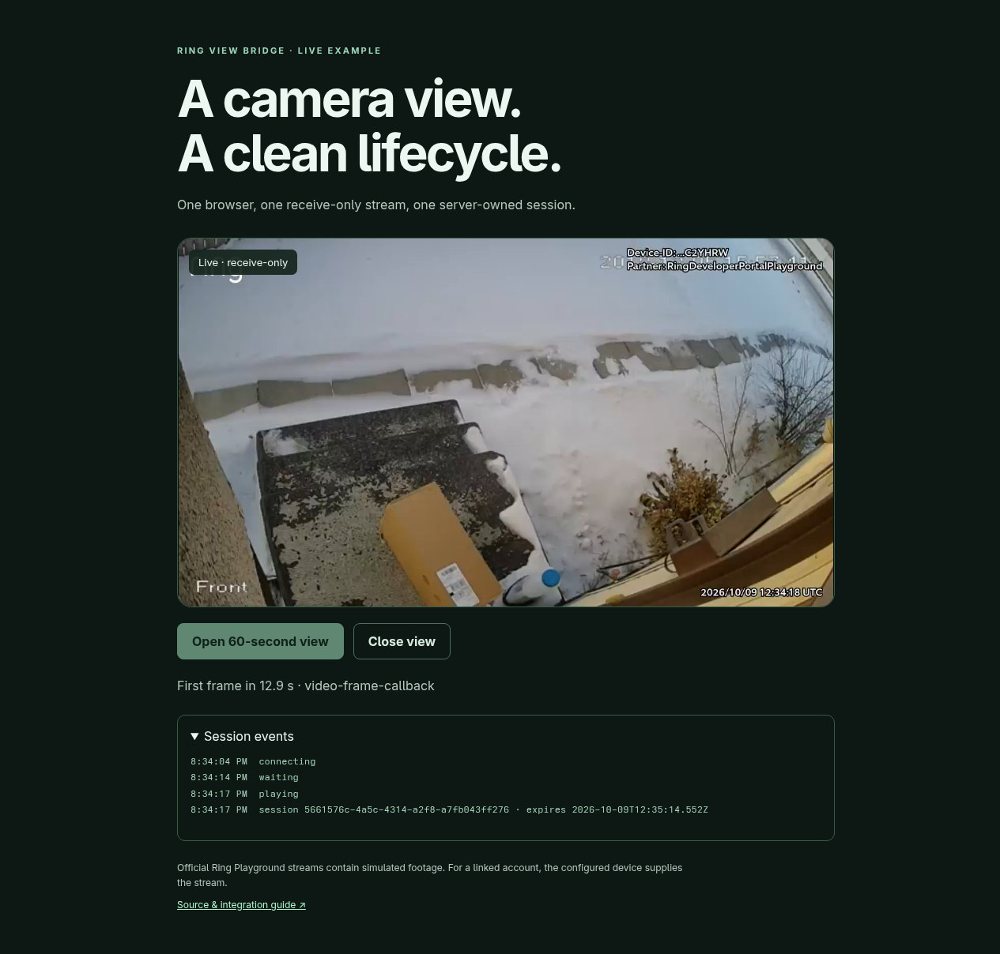

# Released-package integration

On **2026-10-09**, the standalone example and Care Handoff ran against the official Ring Playground using the public **Ring View Bridge 0.1.0 Release asset**. Care Handoff's package-lock pins its integrity, and its browser module was generated from that installed package.

| Observation | Standalone example | Care Handoff |
|---|---|---|
| Official WHEP create | HTTP 201 | HTTP 201 |
| Video | 1280 × 720, frames 1 → 50 | 1280 × 720, frames 6 → 47 |
| First-frame source | `video-frame-callback`, 12.9 s from click | `video-frame-callback` |
| Closure | Explicit viewer close | Cleanup after peer interruption |
| Official WHEP DELETE | HTTP 200 | HTTP 200 |
| Active consumer sessions after cleanup | Released | 0 |

The standalone page also fit a **390 px** viewport. Page errors: **0**. Care Handoff's arrival and completion records stayed empty after viewing, preserving its person-confirmed business workflow.

The initial harness waited for the full 60-second expiry message. The Playground peer disconnected about 20 seconds after creation, and the viewer automatically released it. The raw harness retained that failed text assertion; the API and frame observations above are recorded separately. The local deadline test covers server expiry.

Version **0.1.1** adds a focused cleanup fix: when Ring returns a valid session Location followed by invalid SDP, and the compensating DELETE fails, the pool keeps the local handle and occupied slot for an explicit retry. A local HTTP fixture verifies the failed DELETE, retry, and concurrent-shutdown path. Public event and error data preserve the private upstream URL.

## Latest consumer: 0.1.1

At **12:43 UTC on 2026-10-09**, Care Handoff installed the public **0.1.1** Release, regenerated its browser vendor module, and completed another official WHEP session: create **201**, decoded frames **1 → 50** at **1280 × 720**, viewed report **200**, upstream delete **200**, active sessions **0**. Arrival and completion stayed empty; page errors were **0**. [Installed Release and consumer observations](consumer-0.1.1.json).

[Structured 0.1.0 observations](integration-run.json) · [Consumer source](https://github.com/blucca/care-handoff) · [Standalone app](../examples/minimal)

## Footage attribution

Official simulated Package footage: [“Thief stealing our package”](https://www.youtube.com/watch?v=TfTFu8lGrwk), [frollard](https://www.youtube.com/@frollard), [CC BY 4.0](https://creativecommons.org/licenses/by/4.0/). The screenshot captures and scales the stream inside the minimal app. Token, full device identity, SDP, and upstream session locations remain in private run records.
